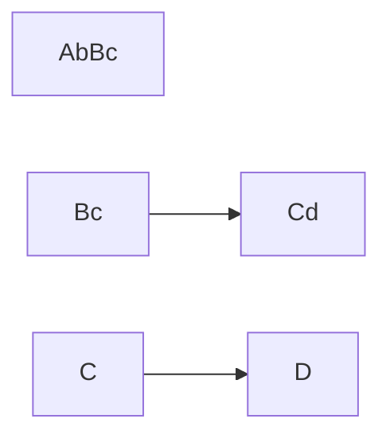

# Linked List

A linked list is a data structure collection of elements that is used in a queue. A linked list is like a train it has many departments, it is linked to the next node. If we need to add to the train we can add in the beginning, the middle, or the end.

## Purpose

## Types

Single linked list
Double linked list

## linked List structure

## Queue Terminology

Table 1.2 explains the basic definitions for data structure and queues.
Node Is an element in a linked list. There are two parts to a node. First part hold data, second holds a reference of memory called pointer.
Head The name of the first node in the linked list.
Tail The name of the last node in the linked list. The pointer usually points to the tail and is empty
Pointer Allocate where a node is located in memory. The location of the next node is stored in the previous node.
Next  A pointer in the node referring to the next node.
Value The actual data store in the node.
Previous A pointer in the node referring to the previous node

Nodes - there are three parts to a node First part holds data and the second part holds reference.
He
F
second part hold

## Operations
